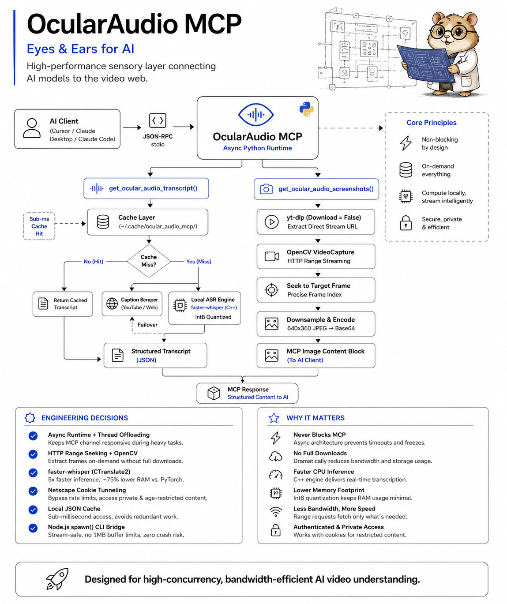

# OcularAudio MCP



An asynchronous Model Context Protocol (MCP) server that gives AI models "eyes and ears" across web media and local media. OcularAudio resolves supported video/audio sources into a canonical media representation, extracts transcripts and visual evidence, and preserves a local-first architecture for deeper intelligence.

## Features

- **Universal media foundation**: Resolves supported web URLs, direct media URLs, live URLs, and local media files through one canonical source layer
- **Four analysis depths**: glance, understand, deep, and omniscient control ingestion fidelity and resource use
- **Hybrid transcript extraction**: Fetches YouTube captions instantly, falls back to local Whisper ASR
- **On-demand video screenshots**: Captures frames at any timestamp without downloading the full video
- **OCR on screenshots**: Extract visible text from frames using Tesseract (optional, `--ocr` flag)
- **Cookie authentication**: Supports age-restricted and private videos via cookies.txt
- **Local caching**: Processed videos are cached for instant subsequent lookups
- **Source inspection**: inspect_ocular_audio_source reports platform, media type, live state, captions, audio/video availability, and source capabilities before expensive processing
- **Async architecture**: Non-blocking design keeps MCP clients responsive
- **Flexible output**: Clipboard, stdout, file, or JSON — your choice

## Benchmark

See [BENCHMARK.md](BENCHMARK.md) for performance benchmarks and a deep competitive analysis against all major video transcript, screenshot, and OCR tools in the MCP and CLI ecosystem.

## Requirements

- **Python 3.9+** (required for `list[int]` type hints)
- **FFmpeg** (required by yt-dlp and OpenCV)
- **Node.js 18+** (only for the CLI wrapper)
- **Tesseract** (optional, only for `--ocr` flag)

## Installation

### 1. Install system dependencies

**macOS:**
```bash
brew install ffmpeg python3
# Optional (for OCR):
brew install tesseract
```

**Windows:**
```bash
choco install ffmpeg python
# Optional (for OCR):
choco install tesseract
```

**Linux:**
```bash
sudo apt update && sudo apt install ffmpeg python3 python3-pip
# Optional (for OCR):
sudo apt install tesseract-ocr
```

### 2. Install Python packages

```bash
pip install -r requirements.txt
```

Or manually:
```bash
pip install mcp youtube-transcript-api yt-dlp opencv-python-headless faster-whisper requests pytesseract
```

### 3. Install Node.js CLI (optional)

```bash
npm install
```

## Usage

### Option A: MCP Server (Recommended)

The MCP server gives AI models direct access to video transcripts and screenshots.

**Quick Install** — No installation needed. Just add the config to your MCP client below.

#### Claude Desktop

```json
{
  "mcpServers": {
    "ocular-audio-mcp": {
      "command": "npx",
      "args": ["ocular-audio-mcp"]
    }
  }
}
```
Config: `~/Library/Application Support/Claude/claude_desktop_config.json` (macOS) or `%APPDATA%\Claude\claude_desktop_config.json` (Windows)

#### Cursor

```json
{
  "mcpServers": {
    "ocular-audio-mcp": {
      "command": "npx",
      "args": ["ocular-audio-mcp"]
    }
  }
}
```
Config: `.cursor/mcp.json` (project) or `~/.cursor/mcp.json` (global)

#### Claude Code

```bash
claude mcp add ocular-audio-mcp -- npx ocular-audio-mcp
```

#### Codex CLI (OpenAI)

```bash
codex mcp add ocular-audio-mcp -- npx ocular-audio-mcp
```

#### Gemini CLI

```bash
gemini mcp add ocular-audio-mcp npx ocular-audio-mcp --scope user
```

#### Windsurf

```json
{
  "mcpServers": {
    "ocular-audio-mcp": {
      "command": "npx",
      "args": ["ocular-audio-mcp"]
    }
  }
}
```
Config: `~/.codeium/windsurf/mcp_config.json`

#### Zed

```json
{
  "context_servers": {
    "ocular-audio-mcp": {
      "command": "npx",
      "args": ["ocular-audio-mcp"]
    }
  }
}
```
Config: `~/.config/zed/settings.json`

#### VS Code (GitHub Copilot)

```json
{
  "servers": {
    "ocular-audio-mcp": {
      "type": "stdio",
      "command": "npx",
      "args": ["ocular-audio-mcp"]
    }
  }
}
```
Config: `.vscode/mcp.json`

#### OpenCode

```json
{
  "mcpServers": {
    "ocular-audio-mcp": {
      "command": "npx",
      "args": ["ocular-audio-mcp"]
    }
  }
}
```
Config: `~/.opencode/config.json`

#### Cline (VS Code Extension)

```json
{
  "mcpServers": {
    "ocular-audio-mcp": {
      "command": "npx",
      "args": ["ocular-audio-mcp"]
    }
  }
}
```

#### Local Development (from source)

```json
{
  "mcpServers": {
    "ocular-audio-mcp": {
      "command": "python",
      "args": ["/path/to/ocular_audio_mcp.py"]
    }
  }
}
```

### Option B: CLI

```bash
npx ocular-audio "https://www.youtube.com/watch?v=dQw4w9WgXcQ"
```

By default, the transcript is printed to stdout and copied to your clipboard. Paste it into Claude Web, ChatGPT, or any AI chat.

#### CLI Options

| Flag | Description |
|------|-------------|
| `-h`, `--help` | Show help message |
| `-v`, `--version` | Show version number |
| `--stdout` | Print transcript to stdout only (no clipboard, no file) |
| `--no-clipboard` | Skip clipboard copy |
| `--output <file>` | Write context to a specific file path |
| `--json` | Output raw JSON (metadata + transcript) for programmatic use |
| `--detail <level>` | Screenshot capture mode: `overview`, `balanced`, `deep`, `auto` (default: `auto`) |
| `--ocr` | Extract text from screenshots using Tesseract OCR |
| `--force` | Bypass cache and re-process the video |
| `--verbose` | Show detailed progress information |
| `--quiet` | Suppress summary and status messages |
| `--check` | Check system dependencies (Python, FFmpeg, Whisper, Tesseract) |
| `--list-cached` | List all cached videos with titles |
| `--cache-info` | Show cache statistics (count, size, oldest/newest) |
| `--clear-cache` | Delete all cached transcripts and screenshots |

#### Examples

```bash
# Basic usage — prints to stdout + copies to clipboard
npx ocular-audio "https://www.youtube.com/watch?v=dQw4w9WgXcQ"

# Stdout only — great for piping to other tools
npx ocular-audio --stdout "https://www.youtube.com/watch?v=dQw4w9WgXcQ" | head -50

# Write to a specific file
npx ocular-audio --output transcript.txt "https://www.youtube.com/watch?v=dQw4w9WgXcQ"

# Raw JSON for programmatic consumption
npx ocular-audio --json "https://www.youtube.com/watch?v=dQw4w9WgXcQ" | jq .metadata.title

# Transcript only, no screenshots
npx ocular-audio --detail overview "https://www.youtube.com/watch?v=dQw4w9WgXcQ"

# Maximum screenshots
npx ocular-audio --detail deep "https://www.youtube.com/watch?v=dQw4w9WgXcQ"

# No clipboard copy, just print to terminal
npx ocular-audio --no-clipboard "https://www.youtube.com/watch?v=dQw4w9WgXcQ"

# Screenshots with OCR — extract visible text from frames
npx ocular-audio --ocr "https://www.youtube.com/watch?v=dQw4w9WgXcQ"

# JSON output with OCR
npx ocular-audio --json --ocr "https://www.youtube.com/watch?v=dQw4w9WgXcQ"

# Force re-process (bypass cache)
npx ocular-audio --force "https://www.youtube.com/watch?v=dQw4w9WgXcQ"

# Verbose mode — see all progress details
npx ocular-audio --verbose "https://www.youtube.com/watch?v=dQw4w9WgXcQ"

# Quiet mode — minimal output
npx ocular-audio --quiet --stdout "https://www.youtube.com/watch?v=dQw4w9WgXcQ"

# Check system capabilities
npx ocular-audio --check

# List cached videos
npx ocular-audio --list-cached

# Show cache stats
npx ocular-audio --cache-info

# Clear all cached data
npx ocular-audio --clear-cache
```

## Cookie Setup (for age-restricted/private videos)

YouTube may block transcript access for age-restricted or private videos. To fix this, export your browser cookies:

1. Install a browser extension like "Get cookies.txt LOCALLY" (Chrome/Firefox)
2. Go to youtube.com while logged in
3. Export cookies to a file named `cookies.txt`
4. Place the file in one of these locations:
   - `~/.cache/ocular_audio_mcp/cookies.txt`
   - `~/.config/ocular_audio_mcp/cookies.txt`
   - `./cookies.txt` (in the project directory)

The server will automatically detect and use the cookies file.

## Phase 2: Evidence Retrieval Layer

Phase 2 turns cached media understanding into a timestamp-addressable evidence layer. Retrieval is deterministic and local-first: the same transcript produces the same ranked evidence without requiring an embedding service or external model.

### Evidence model

Every timestamped transcript segment becomes an evidence record with:
- Stable evidence ID
- Start/end timestamps
- Transcript text
- Chapter association when available
- Deterministic relevance score

### Retrieval tools

### `search_ocular_audio_video`

Searches one video for a natural-language query and returns ranked timestamped evidence plus suggested inspection windows.

**Parameters:**
- `url` (string): Media source
- `query` (string): What to find
- `top_k` (integer, default: 8): Maximum evidence results
- `min_score` (number, default: 0): Optional relevance threshold
- `use_local_whisper` (boolean, default: true): Populate transcript evidence when needed

### `get_ocular_audio_video_timeline`

Returns timestamped transcript evidence for a bounded section without returning the entire transcript.

### `inspect_ocular_audio_moment`

Combines nearby transcript evidence with a targeted frame at an exact timestamp. Optional OCR can be enabled for visible text.

### `search_ocular_audio_cache`

Searches every locally cached transcript and returns the strongest matching evidence across videos.

This establishes the Phase 2 retrieval contract used by later semantic, visual, and embedding-backed retrieval phases.

## Phase 1: Universal Media Foundation

Phase 1 introduces the canonical source layer used by the existing extraction pipeline.

### Supported source classes

- Web URLs handled by OcularAudio/yt-dlp extractors
- Direct media URLs such as MP4/WebM and supported streaming manifests
- Live URLs where the underlying resolver exposes a live stream
- Local video and audio files

OcularAudio does not claim that every website is guaranteed to work. Website support depends on the active extractor, authentication, DRM, and the source being accessible. The resolver exposes those capabilities instead of silently assuming support.

### Analysis depth

| Level | Intent |
|---|---|
| glance | Minimal metadata/transcript-oriented ingestion |
| understand | Recommended default with important visual evidence |
| deep | Higher-fidelity visual/OCR processing |
| omniscient | Maximum practical preservation policy; progressively expanded by later phases |

The ingestion policy is deliberately separate from response size: later phases can preserve more source evidence while returning only the minimum context required by an agent.

### Source inspection

    npx ocular-audio --analysis-depth understand "https://example.com/video"

The MCP source inspection tool can also be called before expensive processing to determine what the resolver can access.

## MCP Tools

### `get_ocular_audio_capabilities`

Returns system capabilities and dependency status. Use this to check what features are available.

**Parameters:** None

**Returns:** System info including Python version, FFmpeg, Whisper, Tesseract, OpenCV, and cookie status.

### `get_ocular_audio_metadata`

Extracts only video metadata (title, creator, duration, views, chapters) without transcript. Much faster than getting the full transcript.

**Parameters:**
- `url` (string): Video URL

### `get_ocular_audio_transcript`

Extracts the complete transcript, video chapters, and metadata from a video.

**Parameters:**
- `url` (string): Video URL
- `use_local_whisper` (boolean, default: true): Enable Whisper fallback if captions unavailable

### `get_ocular_audio_chapters`

Extracts only video chapters with timestamps. Returns chapter titles with start times in [MM:SS] format.

**Parameters:**
- `url` (string): Video URL

### `get_ocular_audio_video_screenshots`

Captures screenshots at specific timestamps.

**Parameters:**
- `url` (string): Video URL
- `timestamps_secs` (array of integers): Timestamps to capture (e.g., `[45, 120, 300]`)
- `enable_ocr` (boolean, default: false): If true, run OCR on each captured frame to extract visible text

### `get_ocular_audio_video_context`

Extracts transcript, metadata, and intelligent screenshots in one call. Automatically analyzes the transcript to find visually important moments and captures screenshots at those timestamps.

**Parameters:**
- `url` (string): Video URL
- `detail_level` (string, default: "auto"): Controls screenshot capture mode:
  - `"auto"` - Adapts to video length and content importance
  - `"overview"` - Transcript and metadata only, no screenshots (fastest)
  - `"balanced"` - Screenshots only at visually important moments (strong signals)
  - `"deep"` - Screenshots at every visually significant moment (all signals)
- `use_local_whisper` (boolean, default: true): Enable Whisper fallback if captions unavailable
- `enable_ocr` (boolean, default: false): If true, run OCR on captured screenshots to extract visible text

### `list_ocular_audio_cache`

Lists all cached videos with their metadata (title, uploader, duration, when cached).

**Parameters:** None

### `clear_ocular_audio_cache`

Clears cached video data.

**Parameters:**
- `video_id` (string, optional): Video ID to clear specific video. If empty, clears all cache.

## Cache Management

Processed videos are cached in `~/.cache/ocular_audio_mcp/` for 7 days. Use the CLI flags to manage the cache:

```bash
npx ocular-audio --list-cached     # See what's cached
npx ocular-audio --cache-info      # Storage stats
npx ocular-audio --clear-cache     # Wipe everything
```

Or manually:
```bash
rm -rf ~/.cache/ocular_audio_mcp/*.json
```

## Troubleshooting

### "No local ASR engines found"
Install a Whisper engine:
```bash
pip install faster-whisper
```

### "Audio track download failed"
- Check your network connection
- For age-restricted videos, add a cookies.txt file (see Cookie Setup above)
- Ensure FFmpeg is installed: `ffmpeg -version`

### "Failed to extract a playable video stream"
- The video may be private or geo-blocked
- Try adding cookies.txt
- Check if the video is still available

### Python not found on Windows
Ensure Python is in your PATH. Try:
```bash
python --version
```
If not found, reinstall Python from python.org and check "Add Python to PATH" during installation.

### MCP server not connecting
- Verify the path in your MCP client config is correct
- Test the server manually: `python /path/to/ocular_audio_mcp.py`
- Check that all dependencies are installed: `pip list | grep -E "mcp|whisper|yt-dlp"`

## License

MIT

 
## Phase 3: Visual Evidence Layer

Phase 3 makes visual evidence a first-class, persistent retrieval surface. Frames are stored locally at higher fidelity than the legacy screenshot path and indexed with deterministic image fingerprints, brightness/contrast statistics, timestamps, and optional OCR.

### Visual indexing

**`index_ocular_audio_video_visuals`** builds or refreshes a persistent frame index for a finite video. It accepts `url`, `interval_seconds` (default 10), `enable_ocr`, and `force`. The index is stored under `~/.cache/ocular_audio_mcp/visual/` and capped at 240 sampled frames.

**`search_ocular_audio_visuals`** searches an existing visual index using OCR text and returns ranked timestamped frames. This is deterministic and local-first; semantic vision embeddings are intentionally deferred to a later phase.

**`get_ocular_audio_video_frame`** captures one higher-resolution frame at an exact timestamp and returns machine-readable metadata plus the image.

**`get_ocular_audio_video_frame_burst`** captures a bounded chronological burst around a timestamp for inspecting transitions, UI changes, demonstrations, and other short visual events.

**`crop_ocular_audio_video_frame`** captures a frame and crops a region using normalized coordinates by default, or pixel coordinates when `normalized=false`. Optional OCR can be run on the crop.

### Visual evidence contract

Each indexed frame includes a stable frame ID, timestamp, persistent image path, dimensions, brightness, contrast, a 64-bit perceptual fingerprint, and OCR text when enabled and available.

Phase 3 complements Phase 2 transcript retrieval: transcript search finds *when* something was discussed, while visual retrieval identifies *what was visible* at indexed moments.

### CLI access

The npm CLI exposes the same visual operations:

```bash
npx ocular-audio --visual-index "URL"
npx ocular-audio --visual-search "revenue chart" "URL"
npx ocular-audio --frame-at 120 "URL"
npx ocular-audio --frame-burst 120 10 5 "URL"
```


 

## Phase 8: Universal Source Foundation

Phase 8 makes source coverage independent from analysis depth. Lite, Intelligence, and Deep are designed to consume the same universal source layer in later phases rather than maintaining separate platform implementations.

### Universal source contract

OcularAudio accepts one canonical input surface:

- Social/video platforms: YouTube, TikTok, Instagram, Facebook, X/Twitter, Snapchat, LinkedIn, Pinterest, Tumblr, VK, OK
- Video platforms: Vimeo, Twitch, Kick, Rumble, Dailymotion, Bilibili, Loom, Streamable, Rutube, Odysee, PeerTube
- Audio platforms: SoundCloud, Bandcamp, Mixcloud, Spotify, Audiomack
- Media/archive sources: Internet Archive, TED, Patreon and other extractor-supported sources
- Generic web URLs when the active yt-dlp extractor can resolve them
- Direct media URLs (MP4, WebM, HLS/DASH manifests and supported audio formats)
- Local video/audio files
- Streaming sources including RTMP-family, RTSP, SRT and UDP URLs where the underlying local tooling can consume them

Platform names are recognition hints, not guarantees of access. Actual availability depends on the active yt-dlp extractor, authentication, DRM, geo restrictions, network access and the source itself.

### Extractor-driven coverage

Unknown websites remain generic_web rather than being rejected because they are not in a hard-coded platform list. After yt-dlp resolution, the extractor key becomes the authoritative platform hint. This lets new extractor-supported sites work without requiring a new OcularAudio release for every host.

### Local-first contract

Phase 8 does not add a hosted service, database, model runtime, or background server. The same lightweight local MCP process continues to resolve and retrieve media on demand. The MCP package remains version 1.3.0.

### Capability discovery

`get_ocular_audio_capabilities` now exposes `source_coverage`, including source families, recognized platforms, generic-web fallback, extractor-driven discovery, local files, direct media URLs, and streaming URLs.
## Phase 7: Agentic Intelligence & Production Hardening

Phase 7 is the orchestration and reliability layer over Phases 1–6. It turns the existing evidence capabilities into an inspectable execution plan, applies bounded retry/timeout policy, records execution evidence, and exposes operational health without requiring a hosted LLM.

### Agentic planning

**`plan_ocular_audio_analysis`** classifies an analysis request and produces a deterministic execution plan. Plans expose their intent, ordered operations, reasons, policy, and stable plan ID.

Supported intents include:
- source inspection
- transcript/visual hybrid search
- visual moment inspection
- OCR inspection
- timeline retrieval
- cross-video search
- cross-video comparison

**`run_ocular_audio_analysis`** executes that plan through the existing MCP capabilities. Every step is bounded by a timeout and retry policy and produces an audit record.

### Production hardening

- Timeout bounds: 1–900 seconds.
- Retry bounds: 0–3 retries.
- Exponential retry backoff.
- Explicit cancellation propagation.
- Query size bounded to 1,000 characters.
- Plan size bounded to 8 steps.
- Structured per-step audit records in local JSONL.
- Health reporting for FFmpeg, OpenCV, Whisper, Tesseract, and cache state.
- No new external service is required for Phase 7.

### MCP tools

#### `plan_ocular_audio_analysis`
Builds an inspectable execution plan without processing media.

#### `run_ocular_audio_analysis`
Executes the plan with timeout/retry controls and returns plan, results, and audit records.

#### `get_ocular_audio_health`
Returns dependency and cache health plus actionable warnings.

#### `get_ocular_audio_audit`
Returns recent local execution records.

### CLI

```bash
npx ocular-audio --plan "find the pricing chart"
npx ocular-audio --agentic "find the pricing chart" "URL"
npx ocular-audio --health
npx ocular-audio --audit
```

### Versioning

OcularAudio's package version remains **1.3.0** across all roadmap phases. Phase numbers identify architectural increments and PRs; they do not imply package version bumps.

## Phase 6: Batch & Multi-Video Intelligence

Phase 6 extends the multimodal evidence contract from one source to a bounded collection of sources. It reuses the existing transcript, visual, OCR, and multimodal layers rather than creating a second retrieval stack.

### Batch capabilities

- **Bounded concurrency**: up to 4 simultaneous media analyses, with 2 as the default.
- **Manifest ingestion**: JSON arrays or `{"videos": [...]}` / `{"sources": [...]}` objects.
- **Stable deduplication**: repeated URLs are processed once per batch.
- **Failure isolation**: one unavailable source does not discard successful sources.
- **Cross-video ranking**: one query produces a unified ranked evidence list across all sources.
- **Per-video comparison**: comparable match counts and best evidence scores for the same query.
- **Persistent batch results**: deterministic batch IDs and atomic JSON persistence under the local cache.
- **Batch retrieval**: previously completed results can be retrieved without reprocessing media.
- **Batch history**: recent batch summaries can be listed without loading video content.
- **Safety bounds**: source count, concurrency, and result counts are explicitly bounded.

### MCP tools

#### `analyze_ocular_audio_batch`

Accepts a JSON manifest and runs multimodal analysis over every unique source. The result contains a deterministic `batch_id`, execution summary, per-source status, and cross-video ranked moments.

#### `search_ocular_audio_videos`

Runs a natural-language multimodal search over multiple videos and returns the strongest evidence across the collection.

#### `compare_ocular_audio_videos`

Runs the same analysis across a collection and returns a per-video scorecard, including query matches, best score, moment count, and failures.

#### `get_ocular_audio_batch`

Retrieves a persisted batch result by its deterministic batch ID.

#### `list_ocular_audio_batches`

Lists recent persisted batches and their source/success/error/moment counts.

### Batch manifest

```json
{
  "videos": [
    {"url": "https://example.com/video-a", "label": "Video A"},
    {"url": "https://example.com/video-b", "label": "Video B"}
  ]
}
```

### CLI

```bash
npx ocular-audio --batch batch.json
npx ocular-audio --batch-search "pricing" batch.json
npx ocular-audio --batch-compare batch.json
```

For batch CLI commands, the positional source is only used to enter the existing CLI execution path; the manifest file is the authoritative set of media sources.

Phase 6 intentionally remains deterministic and local-first. It does not claim cross-video model reasoning or external vector-database infrastructure. It provides the orchestration and evidence aggregation contract required for the next agentic/production-hardening stage.

## Phase 4: Semantic & Hybrid Retrieval

Phase 4 adds a local-first semantic retrieval layer over timestamped transcript and visual OCR evidence. It combines TF-IDF cosine similarity with lexical matching and exposes both component scores and the final fused score.

### `search_ocular_audio_hybrid`

Searches one media source across transcript evidence and indexed visual OCR. Use `semantic_weight` from 0 to 1 to control the semantic/lexical balance.

### `search_ocular_audio_hybrid_cache`

Searches all locally cached evidence across media sources using the same hybrid ranking.

### Retrieval contract

Every result includes:
- final hybrid score
- semantic score
- lexical score
- source type
- timestamp range
- source metadata

This phase intentionally has no external embedding API or vector database dependency. The retrieval contract is designed so a neural embedding backend can replace the TF-IDF scorer later without changing the MCP result surface.

 
## Phase 5: Multimodal Understanding

Phase 5 aligns timestamped transcript evidence with persistent visual frames and optional OCR into unified multimodal moments. The layer is deterministic and inspectable: it reports which modalities are present, the nearby transcript evidence, OCR text, and measurable visual change.

### `analyze_ocular_audio_multimodal`

Builds or refreshes the visual index when necessary, aligns it to transcript evidence, detects frame-to-frame visual change using perceptual hashes, and ranks moments for an optional query.

### `inspect_ocular_audio_multimodal_moment`

Inspects the closest aligned multimodal moment to an exact timestamp and returns the structured evidence plus the associated frame.

### Multimodal contract

A moment can contain:
- transcript evidence around the timestamp
- a timestamped visual frame
- OCR text when enabled and available
- visual-change score
- evidence score
- explicit modality availability

Phase 5 intentionally does not claim model-generated visual reasoning. It creates the evidence-alignment layer required for a later model-backed reasoning engine without coupling the MCP server to a proprietary vision API.

### CLI

```bash
npx ocular-audio --multimodal "URL"
npx ocular-audio --multimodal-search "pricing chart" "URL"
```
